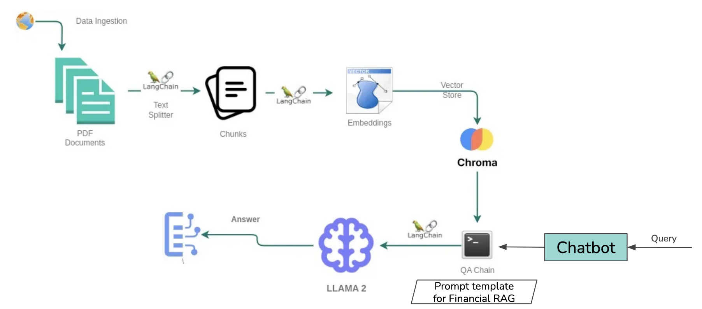
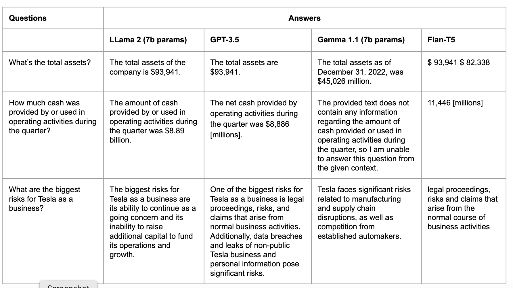
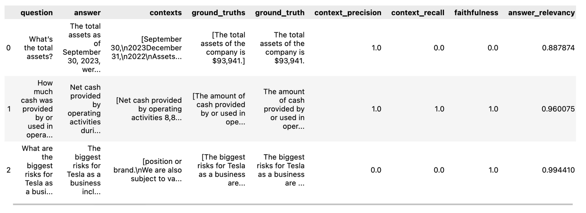

# Chatbot leveraging RAG for Financial Document (10Q, 10K) Summarization

Chatbot leveraging Retrieval Augmented Generation (RAG) for Financial Document Summarization


# Technical Problem Formulation

* **Problem statement:** Given a PDF document and a query, retrieve the relevant details and information from the document as per the query, and synthesize this information to generate accurate answers.
* **Data Ingestion and Processing:** Reading PDFs of financial reports and split the documents for efficient text chunking of long documents.
* **Retrieval-Augmented Generation (RAG):** Combination of document retrieval with the generative capabilities of the chosen language models.
* **Large Language Models:** Evaluation of various models, including GPT-3.5-turbo, LLama 2, Gemma 1.1, etc.
* **Conversation Chain and Prompt Design:** Crafting of a prompt template designed for concise two-sentence financial summaries.
* **User interface:** Designing Chatbot like user interface.

# System architecture


Modified from [blog.goopenai](https://blog.gopenai.com/retrieval-augmented-generation-rag-using-llama-2-chromadb-together-ai-for-retrieval-qa-80e7045a6c79)

# LLMs and Experiments

1. GPT-3.5
2. LLama 2
3. Gemma 1.1
4. Flan-T5



# Evaluation

Metrics:
* **Generation Metrics:** Faithfulness and Answer Relevancy.
* **Retrieval:** Context Recall and Context Precision.

Description:
* **Faithfulness:** This measures the factual consistency of the generated answer against the given context. The generated answer is regarded as faithful if all the claims that are made in the answer can be inferred from the given context. 
* **Answer relevancy:** Scores the relevancy of the answer according to the given question. Answers with incomplete, redundant or unnecessary information is penalized.
* **Context recall:** measures the extent to which the retrieved context aligns with the annotated answer, treated as the ground truth.
* **Context precision:** evaluates whether all of the ground-truth relevant items present in the contexts are ranked higher or not.




# Installation

```
pip install -r requirements.txt
```

# Contributors

| Contributor 1 | Contributor 2 | Contributor 3 |
| ------------- | ------------- | ------------- |
| [Harshit Kumar](https://github.com/kHarshit) | [Sarthak Khandelwal](https://github.com/sarthakforwet) | Alexander Leon |